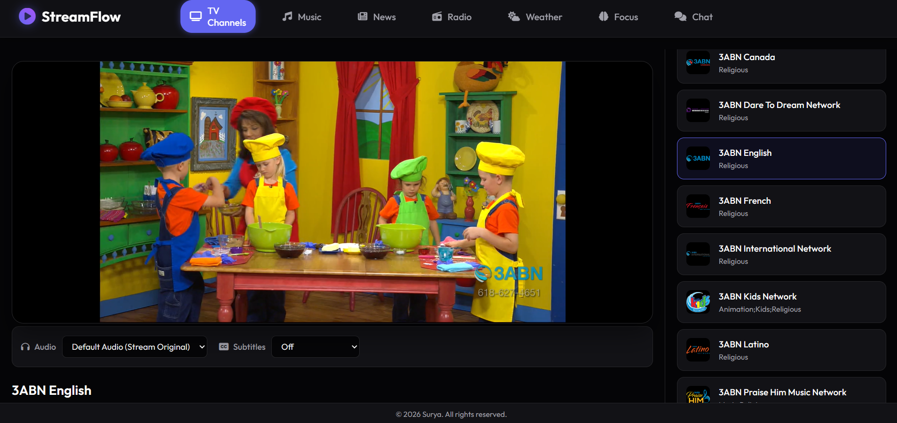
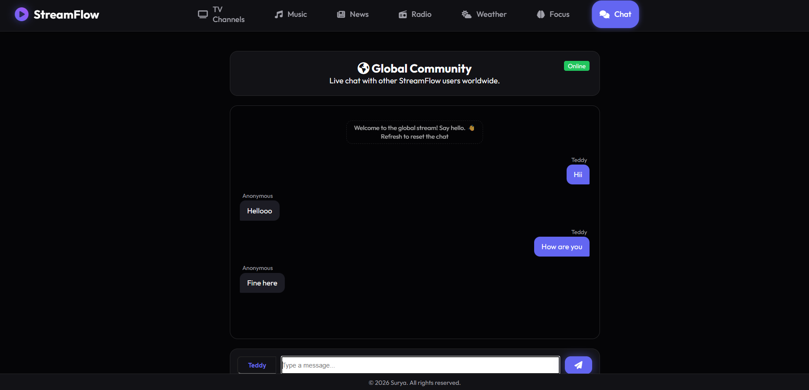
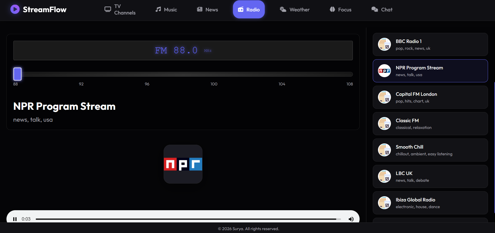
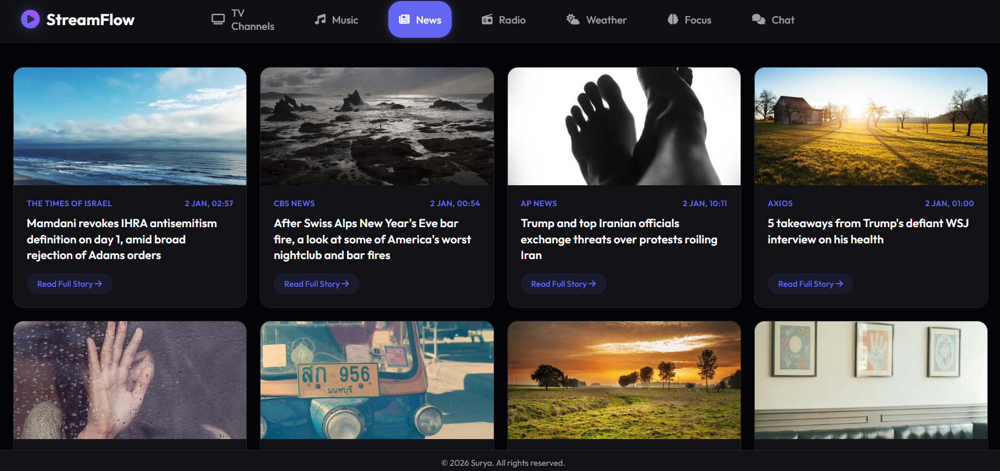
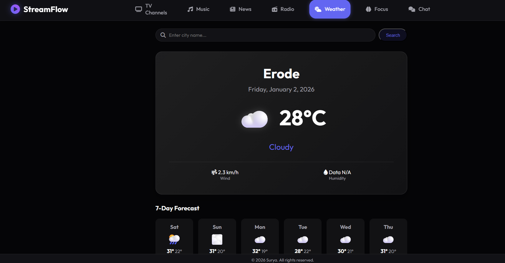
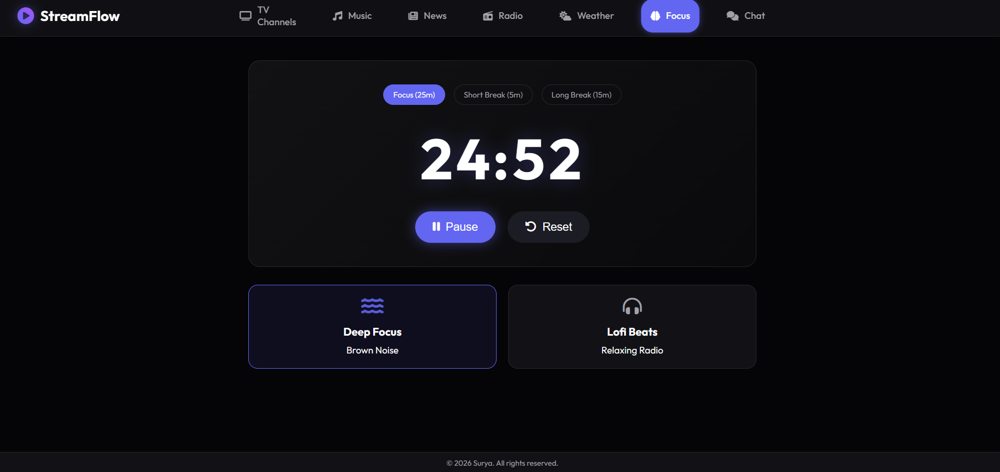

# StreamFlow 🌊

StreamFlow is a modern, all-in-one personal dashboard application that brings together entertainment, information, and productivity tools into a single, beautifully designed interface. 

Built with **HTML**, **CSS**, and **Vanilla JavaScript**, it demonstrates robust frontend architecture without the overhead of heavy frameworks.


## ✨ Features

### 📺 Live TV Streaming
- **HLS Integration:** Seamless playback of m3u8 streams using `hls.js`.
- **Channel Browser:** Dynamic parsing of IPTV playlists (`.m3u`) with infinite scroll.
- **Player Controls:** Custom controls for audio track and subtitle selection.
- **Responsive Player:** Adaptive video player that works perfectly on mobile and desktop.



### 🌍 Global Real-Time Chat
- **Instant Messaging:** Connect with other users globally in real-time.
- **Powered by MQTT:** Built on top of **MQTT.js** over WebSockets (`wss://broker.emqx.io`).
- **Resilient Connectivity:** Auto-reconnection logic and robust fallback mechanisms (Local library -> CDN).
- **Security:** Strict Content Security Policy (CSP) compliant.



### 🎵 Music & Radio
- **Music Search:** Browse and play songs directly within the dashboard.
- **Global Radio Tuner:**
  - Classic FM-style interactive tuner slider.
  - Access to thousands of radio stations via the Radio-Browser API.
  - Filter by country, genre, (e.g., Bollywood, Pop, Rock, News).
  - Audio visualization support.



### 📰 Smart News Aggregator
- **Top Headlines:** Fetches the latest news based on country (USA, India, UK, etc.) and category.
- **Auto-Refresh:** Keeps you updated with automatic content refreshing.
- **Clean UI:** Card-based layout with "Read More" integration.



### ☀️ Weather Forecast
- **Real-Time Data:** Powered by the **Open-Meteo API**.
- **Detailed Metrics:** Current temperature, wind speed, humidity, and weather conditions.
- **7-Day Forecast:** Planning made easy with a week-long outlook.



### 🧠 Focus Mode (Productivity)
- **Pomodoro Timer:** Customizable timer for Focus (25m), Short Break (5m), and Long Break (15m).
- **Ambient Sounds:** Integrated White Noise/Brown Noise generator and Lofi radio for deep work sessions.



---

## 🛠️ Technology Stack

- **Frontend:** HTML5, CSS3, JavaScript (ES6+)
- **Streaming:** [HLS.js](https://github.com/video-dev/hls.js)
- **Real-time Messaging:** [MQTT.js](https://github.com/mqttjs/MQTT.js)
- **Styling:** CSS Variables, Flexbox, Grid, Glassmorphism effects.
- **APIs:**
  - Open-Meteo (Weather)
  - Radio-Browser (Radio)
  - IPTV-Org (TV Channels)

---

## 🚀 Getting Started

### Prerequisites
You need a basic web server to run this application locally to avoid CORS issues (just opening the `index.html` file might restrict some features).

### Installation

1.  **Clone the repository:**
    ```bash
    git clone https://github.com/yourusername/streamflow.git
    cd streamflow
    ```

2.  **Serve the application:**
    You can use a VS Code extension like "Live Server" or Python:

    ```bash
    # using Python 3
    python -m http.server 8000
    ```

3.  **Open in Browser:**
    Navigate to `http://localhost:8000`

---

## 🛡️ Security

This project implements a strict **Content Security Policy (CSP)** to prevent XSS attacks while allowing necessary connections to:
- `broker.emqx.io` (Chat)
- `api.open-meteo.com` (Weather)
- Stream sources (HLS/Radio)

---

## 📄 License

This project is open-source and available under the [MIT License](LICENSE).

---

Made with ❤️ by [Your Name]
